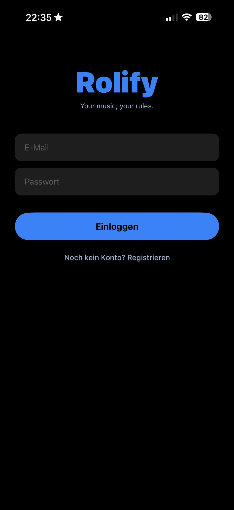
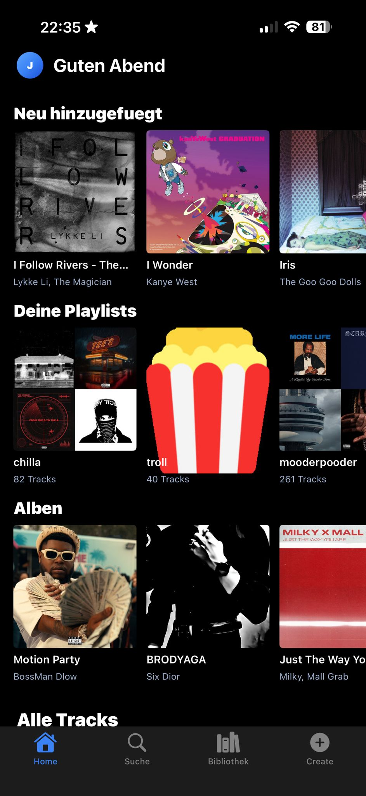
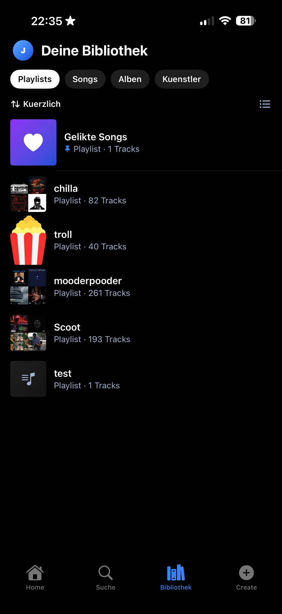
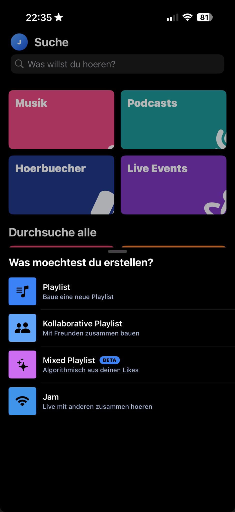

# Rolify

Self-hosted Spotify-Klon. Native iOS App, eigenes Backend, automatisierte Music-Acquisition-Pipeline, Custom-DRM fuer Offline-Songs, Jam-Feature.

## Screenshots

<p align="center">
  
  
  
  
</p>

## Struktur

```
apps/
  backend/       Node.js Fastify API + Prisma
  ios/           Swift / SwiftUI Xcode Projekt
scraping/
  ui_scraper/    Parallel async Agents fuer Design-Token-Extraktion
  music_acquirer/ Spotify-Meta + yt-dlp + ffmpeg + AES-Encryption
design-tokens/   Output der UI-Scraping-Pipeline (committed)
infra/           Docker-Compose, Nginx-Config, Certs
.github/
  workflows/     CI fuer iOS-Build + Backend-Deploy + Scraping-Cron
```

## Stack

- **iOS:** Swift + SwiftUI (iOS 17+), Build via GitHub Actions macOS-Runner, Deploy via SideStore
- **Backend:** Node.js 22 + Fastify + TypeScript + Prisma
- **DB / Cache:** PostgreSQL 16, Redis 7
- **Storage:** MinIO (S3-kompatibel, selfhosted)
- **Scraping:** Python 3.12, Playwright, yt-dlp, ffmpeg
- **CDN:** Cloudflare (Free Tier)
- **Payments:** Stripe (Phase 2, nach MVP)

## Quickstart

```bash
cp infra/.env.example infra/.env
cd infra && docker compose up -d
cd ../apps/backend && pnpm install && pnpm prisma migrate dev && pnpm dev
cd ../../scraping && pip install -r requirements.txt
```

## MVP-Scope

Account / Profile / Catalog / Playlists / Library / Playback (online + offline mit DRM) / Jam.
Payments + Paywall + Grace-Period erst **Phase 2** nach MVP.
